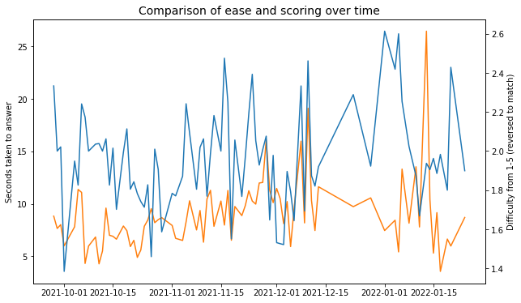

# Anki analysis

I use spaced repetition to study. This is a short notebooks where I unpack the SQLite database which tracks the >1200 cards I have, and my scores when I review them.

A big thanks to the team at [Anki](https://apps.ankiweb.net/) for their great product and [documentation](https://github.com/ankidroid/Anki-Android/wiki/Database-Structure).

## Other tools used

- SQLite
- Python: time, pandas, matplotlib
